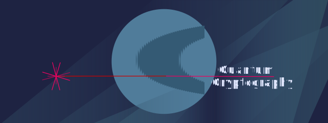
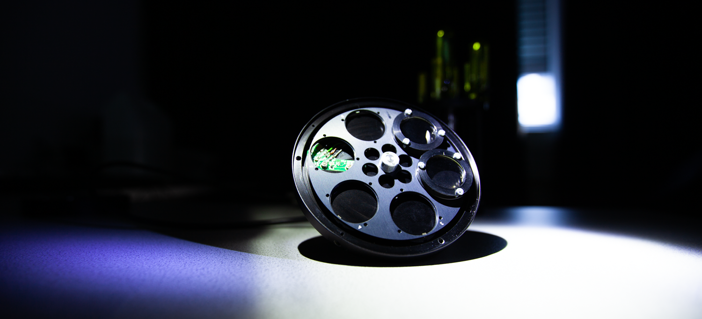

Demonstration of **quantum-cryptography-based one-time pad communication** via the **BB84 algorithm** using a non-single photon source.

[project progress](#project-progress) | [contributors](#contributors) | [repository structure](#repository-structure) | [frequently asked questions](#frequently-asked-questions)

---

## project progress

Kanban Boards:  [**Everyone**](https://github.com/bmedicke/quantum_cryptography/projects/1?fullscreen=true), [Ben](https://github.com/bmedicke/quantum_cryptography/projects/1?fullscreen=true&card_filter_query=assignee%3Abmedicke), [Ferdi](https://github.com/bmedicke/quantum_cryptography/projects/1?fullscreen=true&card_filter_query=assignee%3Aosomo3000), [Manu](https://github.com/bmedicke/quantum_cryptography/projects/1?fullscreen=true&card_filter_query=assignee%3Anamanuel), [Niko](https://github.com/bmedicke/quantum_cryptography/projects/1?fullscreen=true&card_filter_query=assignee%3Anikobenedikt)

## contributors

| Author           | GitHub profile                                  | homepage                                 |
|------------------|-------------------------------------------------|------------------------------------------|
| Benjamin Medicke | [bmedicke](https://github.com/bmedicke)         | [benmedicke.com](https://benmedicke.com) |
| Ferdi Cevik      | [Osomo3000](https://github.com/Osomo3000)       | [cf-projects](http://cf-projects.net/)   |
| Manuel Nagel     | [namanuel](https://github.com/namanuel)         |                                          |
| Nikolai Benedikt | [nikobenedikt](https://github.com/nikobenedikt) |                                          |

## repository structure

Here's a quick breakdown of what to find where in the repository:

* [Theory](markdown/theory.md) 💭 describes the the BB84 algorithm and required theory
* [Hardware](markdown/hardware.md) 🔭 collects information about which hardware was used and how to set it up
* [3D models](3d-models) 🏗️ holds printable components
* [Setup](markdown/setup.md) 🧑🏻‍💻 installation instructions for the software and required services
* [Notebooks](notebooks) 🪐 contains the actual JupyterLab Notebooks for Alice, Bob and Eve
* [Guidelines](markdown/guidelines.md) ✒️  coding and contribution guidelines
* [qcrypt docs](https://bmedicke.github.io/quantum_cryptography) 📜 documentation for the quantum crypto library

## frequently asked questions

**Why build some components instead of using the respective ThorLabs versions?**

Mainly to keep it open-source and reduce the size of the hardware setup. As an added bonus it lowers the cost and barrier of entry for anyone who is interested in replicating the project.

> 
> ThorLabs motorized filter wheel

**What hardware do I need to run this project?**

See [Hardware](markdown/hardware.md) for a list of required components and [3D models](3d-models) for printable parts.

**Why use JupyterLab Notebooks as a frontend?**

On one hand, JupyterLab provides an interactive, browser-based computing environment, which makes it easy to do exploratory coding.
On the other hand, different types of cells in a notebook allow code and markdown-based documentation to live in the same document.
We hope this makes it easier to follow both the code and BB84 protocol.

**Is Python 3.9 absolutely required?**

Yes. We make use of some of the [new features](https://docs.python.org/3/whatsnew/3.9.html).

**When running `pip install -r requirements.txt` it fails with `Building wheel for smbus (setup.py) ... error`.**

You are probably not on a Raspberry Pi with Raspbian (or a similar operating system). This is due to missing I2C. If you're just interested in seeing the notebooks and running some parts of them you can remove the smbus line from `requirements.txt`. You won't be able to use the quantum channel, of course.
